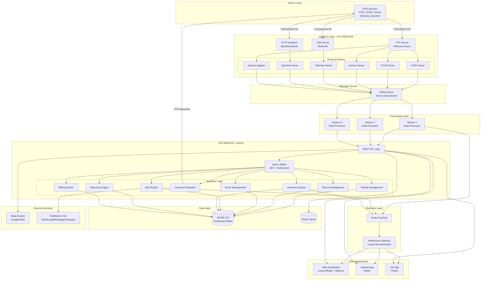
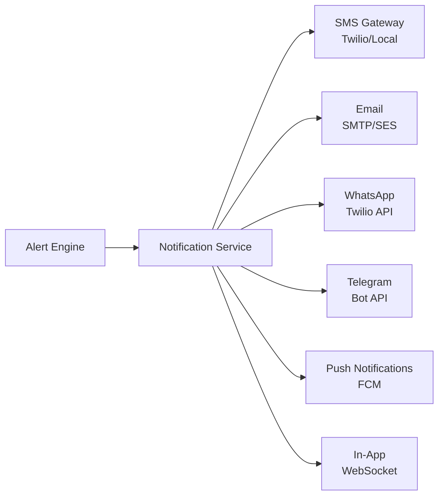

# GPS Tracking Platform - System Architecture Overview

## Executive Summary

This document outlines the complete architecture for a production-ready, multi-tenant GPS tracking SaaS platform designed to support all common GPS devices used in Bangladesh, with mixed protocol support (TCP/UDP/HTTP), real-time tracking, fleet management, and white-label capabilities.

---

## 1. High-Level Architecture



---

## 2. Component Architecture

### 2.1 Device Ingestion Layer

**Purpose**: Accept GPS data from devices using multiple protocols and ports

**Technology Stack**:

- **Language**: Node.js (for async I/O performance) or Go (for high concurrency)
- **Framework**: Custom TCP/UDP servers using `net` module or Go's `net` package
- **Deployment**: Standalone service, containerized

**Components**:

#### TCP Server (Multi-port, Async)

```
Ports: 5000-5010 (configurable per device type)
Features:
- Async connection handling
- Keep-alive support
- Auto protocol detection
- Connection pooling
- Heartbeat monitoring
```

#### UDP Server

```
Ports: 6000-6010
Features:
- Stateless packet handling
- High throughput
- Packet validation
```

#### HTTP Endpoint

```
Route: POST /api/device/push
Auth: IMEI + Device Key
Format: JSON payload
```

#### Protocol Parser Framework

```
Interface:
- parse(rawData: Buffer): ParsedData
- validate(data: ParsedData): boolean
- getDeviceInfo(data: ParsedData): DeviceInfo
- extractLocation(data: ParsedData): Location
```

**Supported Protocols**:

1. **HT02** - Common in Bangladesh trackers
2. **GT06** - Widely used protocol
3. **Concox** - Popular Chinese devices
4. **Teltonika** - Advanced fleet devices
5. **Queclink** - Enterprise devices
6. **Generic** - Configurable adapter for custom protocols

---

### 2.2 Core Backend (Laravel)

**Technology Stack**:

- **Framework**: Laravel 11.x
- **PHP**: 8.2+
- **Authentication**: Laravel Sanctum (SPA) + JWT (Mobile)
- **Queue**: Laravel Queue with Redis driver
- **Cache**: Redis
- **Storage**: Local + S3-compatible (for reports, exports)

**Architecture Pattern**: Domain-Driven Design (DDD) with Repository Pattern

**Module Structure**:

```
app/
├── Domain/
│   ├── Auth/
│   │   ├── Models/
│   │   │   ├── User.php
│   │   │   ├── Role.php
│   │   │   └── Permission.php
│   │   ├── Services/
│   │   │   ├── AuthService.php
│   │   │   └── TenantService.php
│   │   └── Repositories/
│   ├── Vehicle/
│   │   ├── Models/
│   │   │   ├── Vehicle.php
│   │   │   ├── VehicleGroup.php
│   │   │   └── VehicleType.php
│   │   ├── Services/
│   │   │   └── VehicleService.php
│   │   └── Repositories/
│   ├── Device/
│   │   ├── Models/
│   │   │   ├── Device.php
│   │   │   ├── DeviceModel.php
│   │   │   └── DeviceCommand.php
│   │   ├── Services/
│   │   │   ├── DeviceService.php
│   │   │   └── CommandDispatcher.php
│   │   └── Repositories/
│   ├── Tracking/
│   │   ├── Models/
│   │   │   ├── GpsData.php
│   │   │   ├── Trip.php
│   │   │   └── Stop.php
│   │   ├── Services/
│   │   │   ├── TrackingService.php
│   │   │   └── PlaybackService.php
│   │   └── Repositories/
│   ├── Alert/
│   │   ├── Models/
│   │   │   ├── AlertRule.php
│   │   │   ├── Alert.php
│   │   │   └── AlertType.php
│   │   ├── Services/
│   │   │   └── AlertEngine.php
│   │   └── Repositories/
│   ├── Geofence/
│   │   ├── Models/
│   │   │   ├── Geofence.php
│   │   │   └── GeofenceEvent.php
│   │   ├── Services/
│   │   │   └── GeofenceEngine.php
│   │   └── Repositories/
│   ├── Report/
│   │   ├── Models/
│   │   │   ├── Report.php
│   │   │   └── ReportSchedule.php
│   │   ├── Services/
│   │   │   └── ReportEngine.php
│   │   └── Generators/
│   │       ├── TripReportGenerator.php
│   │       ├── FuelReportGenerator.php
│   │       └── DriverBehaviorGenerator.php
│   └── Billing/
│       ├── Models/
│       │   ├── Subscription.php
│       │   ├── Plan.php
│       │   ├── Invoice.php
│       │   └── Payment.php
│       ├── Services/
│       │   ├── BillingService.php
│       │   └── SubscriptionManager.php
│       └── Repositories/
```

---

### 2.3 Multi-Tenant Architecture

**Tenant Isolation Strategy**: Database-level isolation with shared schema

**Tenant Hierarchy**:

```
Super Admin (Platform Owner)
    └── Reseller (White-label Partner)
        └── Company (End Customer)
            └── User (Company Employee)
                └── Driver (Mobile App User)
```

**Implementation**:

- Middleware: `TenantMiddleware` - Sets tenant context
- Scopes: Global scope on all models for automatic tenant filtering
- Database: `tenant_id` column on all tenant-specific tables

**RBAC Structure**:

```
Roles:
- super_admin: Full platform access
- reseller_admin: Manage companies, billing
- company_admin: Manage vehicles, users, devices
- company_user: View tracking, reports
- driver: Mobile app access only

Permissions (examples):
- vehicles.view
- vehicles.create
- vehicles.edit
- vehicles.delete
- devices.manage
- alerts.configure
- reports.generate
- billing.view
```

---

### 2.4 Real-time Layer

**Technology Stack**:

- **Redis**: Pub/Sub + Caching
- **WebSocket**: Laravel Reverb (Laravel 11) or Soketi (self-hosted Pusher alternative)

**Real-time Events**:

```
Channels:
- tracking.{vehicle_id}: Live GPS updates
- alerts.{tenant_id}: Alert notifications
- commands.{device_id}: Command responses

Event Types:
- LocationUpdated
- AlertTriggered
- GeofenceEntered
- GeofenceExited
- CommandExecuted
- DeviceOnline
- DeviceOffline
```

**Flow**:

1. Device sends data → Ingestion Layer
2. Worker processes → Publishes to Redis Pub/Sub
3. WebSocket server subscribes → Broadcasts to connected clients
4. Web/Mobile clients receive real-time updates

---

### 2.5 Database Architecture

**Technology**: MySQL 8.0

**Design Principles**:

- Partitioned tables for time-series GPS data
- Optimized indexes for common queries
- Archiving strategy for old data
- Read replicas for reporting

**Partitioning Strategy**:

```sql
-- GPS data partitioned by month
CREATE TABLE gps_data (
    id BIGINT UNSIGNED AUTO_INCREMENT,
    device_id INT UNSIGNED NOT NULL,
    latitude DECIMAL(10, 8) NOT NULL,
    longitude DECIMAL(11, 8) NOT NULL,
    speed DECIMAL(5, 2),
    heading SMALLINT UNSIGNED,
    altitude DECIMAL(7, 2),
    satellites TINYINT UNSIGNED,
    gps_time DATETIME NOT NULL,
    server_time DATETIME NOT NULL,
    created_at TIMESTAMP DEFAULT CURRENT_TIMESTAMP,
    PRIMARY KEY (id, created_at),
    INDEX idx_device_time (device_id, created_at),
    INDEX idx_gps_time (gps_time)
) PARTITION BY RANGE (YEAR(created_at) * 100 + MONTH(created_at)) (
    PARTITION p202601 VALUES LESS THAN (202602),
    PARTITION p202602 VALUES LESS THAN (202603),
    -- Auto-created monthly partitions
    PARTITION pmax VALUES LESS THAN MAXVALUE
);
```

**Retention Policy**:

- Raw GPS data: 12 months in hot storage
- Aggregated data (trips, stops): Forever
- Archived raw data: Cold storage (S3) after 12 months

---

### 2.6 Maps Engine

**Hybrid Strategy**: Support both Google Maps and OpenStreetMap

**Implementation**:

```javascript
// Frontend abstraction
class MapProvider {
    constructor(provider = 'google') {
        this.provider = provider;
        this.map = this.initMap();
    }

    initMap() {
        switch(this.provider) {
            case 'google':
                return new GoogleMapAdapter();
            case 'osm':
                return new OpenStreetMapAdapter();
        }
    }

    // Unified interface
    addMarker(lat, lng, options) { ... }
    drawPolyline(points) { ... }
    drawPolygon(points) { ... }
    fitBounds(bounds) { ... }
}
```

**Features**:

- Live tracking markers
- Playback route rendering
- Geofence visualization (circles, polygons)
- Traffic layer (Google Maps only)
- Satellite view
- Routing and directions

**User Preference**: Per-user setting in database

---

### 2.7 Notification System

**Multi-Channel Architecture**:



**Implementation**:

```php
// Laravel Notification
class SpeedAlertNotification extends Notification
{
    public function via($notifiable)
    {
        return ['database', 'mail', 'sms', 'whatsapp', 'telegram', 'fcm'];
    }

    public function toMail($notifiable) { ... }
    public function toSms($notifiable) { ... }
    public function toWhatsApp($notifiable) { ... }
    public function toTelegram($notifiable) { ... }
    public function toFcm($notifiable) { ... }
}
```

**User Preferences**: Per-user notification channel settings

---

### 2.8 Billing System

**Business Model**:

1. **One-time Device Registration Fee**: $10-20 per device
2. **Monthly Subscription per Vehicle**: $5-15/month
3. **Tiered Plans**: Basic, Pro, Enterprise

**Features**:

- Automated invoice generation
- Payment gateway integration (Stripe, PayPal, local BD gateways)
- Subscription lifecycle management
- Expiry alerts (7 days, 3 days, 1 day before)
- Grace period (3-7 days)
- Auto-suspension on non-payment
- Feature gating based on plan

**Plan Features**:

```
Basic Plan ($5/vehicle/month):
- Live tracking
- 30-day history
- Basic reports
- Email alerts

Pro Plan ($10/vehicle/month):
- All Basic features
- 90-day history
- Advanced reports
- Geofencing
- Multi-channel alerts
- Driver management

Enterprise Plan ($15/vehicle/month):
- All Pro features
- Forever history
- Custom reports
- API access
- White-label branding
- Priority support
```

---

## 3. Security Architecture

### 3.1 Authentication & Authorization

**Web Application**:

- Laravel Sanctum SPA authentication
- CSRF protection
- Session-based with secure cookies

**Mobile Application**:

- JWT tokens (Laravel Sanctum token abilities)
- Refresh token mechanism
- Biometric authentication (optional)

**Device Authentication**:

- IMEI + Device Key validation
- IP whitelisting (optional)
- Rate limiting per device

### 3.2 Security Measures

```
✓ JWT with short expiry (15 min) + refresh tokens
✓ Role-based access control (RBAC)
✓ Multi-tenant data isolation
✓ Encrypted device communication (TLS for HTTP, optional for TCP/UDP)
✓ SQL injection prevention (Eloquent ORM)
✓ XSS protection (Blade escaping)
✓ CSRF protection (Laravel default)
✓ Rate limiting (Laravel throttle)
✓ Audit logs (all critical actions)
✓ IP restrictions for admin access
✓ Two-factor authentication (optional)
✓ Password policies
✓ API key management
```

---

## 4. Deployment Architecture

### 4.1 VPS Infrastructure

**Recommended Specs** (for 1000 devices):

```
Application Server:
- CPU: 4 cores
- RAM: 8GB
- Storage: 100GB SSD
- OS: Ubuntu 22.04 LTS

Database Server:
- CPU: 4 cores
- RAM: 16GB
- Storage: 500GB SSD (expandable)

Redis Server:
- CPU: 2 cores
- RAM: 4GB
- Storage: 20GB SSD

Device Ingestion Server:
- CPU: 4 cores
- RAM: 8GB
- Storage: 50GB SSD
```

### 4.2 Docker Architecture

```yaml
# docker-compose.yml structure
services:
  nginx:
    # Reverse proxy

  laravel-app:
    # PHP-FPM application

  laravel-queue:
    # Queue workers

  laravel-scheduler:
    # Cron scheduler

  websocket:
    # Laravel Reverb/Soketi

  device-server-tcp:
    # TCP ingestion service

  device-server-udp:
    # UDP ingestion service

  mysql:
    # Database

  redis:
    # Cache + Queue + Pub/Sub

  phpmyadmin:
    # DB management (dev only)
```

### 4.3 Scaling Strategy

**Horizontal Scaling**:

```
Load Balancer (Nginx)
    ├── App Server 1
    ├── App Server 2
    └── App Server N

Database
    ├── Master (Write)
    └── Replicas (Read) x N

Redis Cluster
    ├── Master
    └── Replicas x N

Device Servers
    ├── TCP Server 1 (Ports 5000-5003)
    ├── TCP Server 2 (Ports 5004-5007)
    └── TCP Server N (Ports 5008-5010)
```

**Auto-scaling Triggers**:

- CPU > 70%
- Memory > 80%
- Queue depth > 1000 jobs
- Active connections > 5000

---

## 5. Technology Stack Summary

| Component             | Technology        | Justification                                     |
| --------------------- | ----------------- | ------------------------------------------------- |
| **Backend Framework** | Laravel 11        | Mature ecosystem, built-in auth, queue, cache     |
| **Database**          | MySQL 8.0         | Proven for time-series data, partitioning support |
| **Cache/Queue**       | Redis             | High performance, pub/sub support                 |
| **Device Server**     | Node.js/Go        | Async I/O, high concurrency                       |
| **WebSocket**         | Laravel Reverb    | Native Laravel integration                        |
| **Web Frontend**      | Blade + Alpine.js | Server-rendered, lightweight reactivity           |
| **Mobile App**        | Flutter           | Single codebase, native performance               |
| **Maps**              | Google Maps + OSM | Hybrid for flexibility                            |
| **Notifications**     | Twilio + Custom   | Multi-channel support                             |
| **Containerization**  | Docker            | Portability, easy deployment                      |
| **Reverse Proxy**     | Nginx             | Industry standard, high performance               |
| **CI/CD**             | GitHub Actions    | Free, integrated                                  |

---

## 6. Data Flow Examples

### 6.1 Live Tracking Flow

```
1. GPS Device → TCP Server (Port 5001)
2. TCP Server → Protocol Parser (GT06)
3. Parser → Redis Queue (gps:data:incoming)
4. Queue Worker → Process & Validate
5. Worker → MySQL (gps_data table)
6. Worker → Redis Pub/Sub (tracking.{vehicle_id})
7. WebSocket Server → Broadcast to clients
8. Web/Mobile → Update map marker
```

### 6.2 Alert Flow

```
1. GPS Data → Alert Engine
2. Alert Engine → Evaluate Rules (speed > 80 km/h)
3. Rule Matched → Create Alert Record
4. Alert Service → Notification Service
5. Notification Service → SMS + Email + Push
6. Notification Service → WebSocket (real-time)
7. User → Receives alert
```

### 6.3 Command Dispatch Flow

```
1. User → Web UI (Cut Engine)
2. API → Command Queue
3. Command Dispatcher → Find Device Connection
4. Dispatcher → Send Command via TCP
5. Device → Execute & Respond
6. TCP Server → Parse Response
7. Response → Update Command Status
8. WebSocket → Notify User (Success/Fail)
```

---

## 7. Performance Targets

| Metric                 | Target             | Strategy                                |
| ---------------------- | ------------------ | --------------------------------------- |
| **GPS Data Ingestion** | 10,000 packets/sec | Async servers, queue buffering          |
| **API Response Time**  | < 200ms (p95)      | Redis caching, DB indexing              |
| **WebSocket Latency**  | < 100ms            | Redis pub/sub, optimized broadcasting   |
| **Map Load Time**      | < 2s               | Lazy loading, marker clustering         |
| **Report Generation**  | < 5s (30-day)      | Background jobs, pre-aggregation        |
| **Database Query**     | < 50ms (p95)       | Partitioning, proper indexing           |
| **Concurrent Users**   | 10,000+            | Horizontal scaling, load balancing      |
| **Device Connections** | 50,000+            | Connection pooling, efficient protocols |

---

## 8. Monitoring & Observability

**Metrics to Track**:

- Device connection count
- GPS data ingestion rate
- Queue depth and processing time
- API response times
- Database query performance
- WebSocket connection count
- Error rates
- Alert trigger frequency

**Tools**:

- Laravel Telescope (dev)
- Laravel Horizon (queue monitoring)
- Prometheus + Grafana (production metrics)
- Sentry (error tracking)
- Custom admin dashboard

---

## Next Steps

This architecture provides a solid foundation for a production-ready GPS tracking platform. The next phases will detail:

1. **Database Schema** - Complete table structures and relationships
2. **Device Server Implementation** - Protocol parsers and connection handling
3. **Backend APIs** - RESTful endpoints and business logic
4. **Frontend UI** - Dashboard and tracking interface
5. **Mobile Apps** - Flutter implementation
6. **Deployment Guide** - Step-by-step VPS setup

---

**Document Version**: 1.0  
**Last Updated**: 2026-02-10  
**Status**: Architecture Approved - Ready for Implementation
