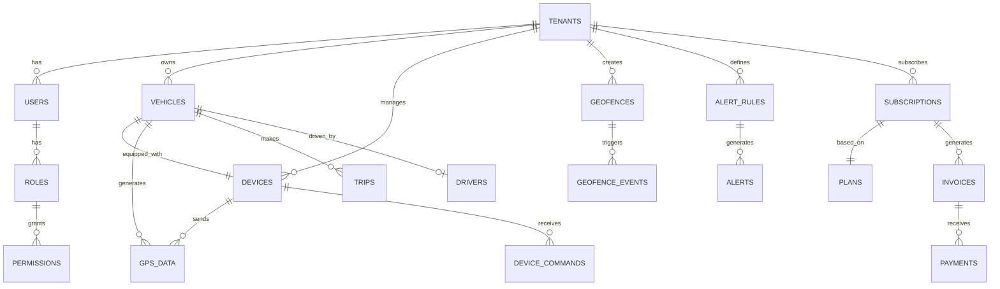

# GPS Tracking Platform - Database Schema

## Overview

This document defines the complete MySQL 8.0 database schema for the GPS tracking platform. The schema supports multi-tenancy, vehicle/device management, real-time GPS tracking, geofencing, alerts, reporting, and billing.

---

## Schema Design Principles

1. **Multi-tenant Isolation**: `tenant_id` on all tenant-specific tables
2. **Soft Deletes**: `deleted_at` for logical deletion
3. **Timestamps**: `created_at`, `updated_at` on all tables
4. **Partitioning**: Time-series data partitioned by month
5. **Indexing**: Optimized for common query patterns
6. **Foreign Keys**: Enforced relationships with cascading rules
7. **JSON Columns**: For flexible metadata storage

---

## Entity Relationship Diagram



---

## Table Definitions

### 1. Multi-Tenancy & Authentication

#### 1.1 `tenants`

```sql
CREATE TABLE tenants (
    id INT UNSIGNED AUTO_INCREMENT PRIMARY KEY,
    parent_id INT UNSIGNED NULL COMMENT 'For reseller hierarchy',
    type ENUM('super_admin', 'reseller', 'company') NOT NULL,
    name VARCHAR(255) NOT NULL,
    slug VARCHAR(255) UNIQUE NOT NULL,
    email VARCHAR(255) NOT NULL,
    phone VARCHAR(50),
    address TEXT,
    logo VARCHAR(255),
    settings JSON COMMENT 'White-label settings, preferences',
    is_active BOOLEAN DEFAULT TRUE,
    created_at TIMESTAMP DEFAULT CURRENT_TIMESTAMP,
    updated_at TIMESTAMP DEFAULT CURRENT_TIMESTAMP ON UPDATE CURRENT_TIMESTAMP,
    deleted_at TIMESTAMP NULL,

    INDEX idx_parent (parent_id),
    INDEX idx_type (type),
    INDEX idx_active (is_active),
    FOREIGN KEY (parent_id) REFERENCES tenants(id) ON DELETE CASCADE
) ENGINE=InnoDB DEFAULT CHARSET=utf8mb4 COLLATE=utf8mb4_unicode_ci;
```

#### 1.2 `users`

```sql
CREATE TABLE users (
    id BIGINT UNSIGNED AUTO_INCREMENT PRIMARY KEY,
    tenant_id INT UNSIGNED NOT NULL,
    name VARCHAR(255) NOT NULL,
    email VARCHAR(255) NOT NULL,
    phone VARCHAR(50),
    password VARCHAR(255) NOT NULL,
    email_verified_at TIMESTAMP NULL,
    two_factor_secret VARCHAR(255) NULL,
    two_factor_enabled BOOLEAN DEFAULT FALSE,
    avatar VARCHAR(255),
    timezone VARCHAR(50) DEFAULT 'Asia/Dhaka',
    language VARCHAR(10) DEFAULT 'en',
    is_active BOOLEAN DEFAULT TRUE,
    last_login_at TIMESTAMP NULL,
    last_login_ip VARCHAR(45) NULL,
    remember_token VARCHAR(100),
    created_at TIMESTAMP DEFAULT CURRENT_TIMESTAMP,
    updated_at TIMESTAMP DEFAULT CURRENT_TIMESTAMP ON UPDATE CURRENT_TIMESTAMP,
    deleted_at TIMESTAMP NULL,

    UNIQUE KEY unique_email_tenant (email, tenant_id),
    INDEX idx_tenant (tenant_id),
    INDEX idx_active (is_active),
    FOREIGN KEY (tenant_id) REFERENCES tenants(id) ON DELETE CASCADE
) ENGINE=InnoDB DEFAULT CHARSET=utf8mb4 COLLATE=utf8mb4_unicode_ci;
```

#### 1.3 `roles`

```sql
CREATE TABLE roles (
    id INT UNSIGNED AUTO_INCREMENT PRIMARY KEY,
    tenant_id INT UNSIGNED NULL COMMENT 'NULL for system roles',
    name VARCHAR(100) NOT NULL,
    slug VARCHAR(100) NOT NULL,
    description TEXT,
    is_system BOOLEAN DEFAULT FALSE COMMENT 'System roles cannot be deleted',
    created_at TIMESTAMP DEFAULT CURRENT_TIMESTAMP,
    updated_at TIMESTAMP DEFAULT CURRENT_TIMESTAMP ON UPDATE CURRENT_TIMESTAMP,

    UNIQUE KEY unique_slug_tenant (slug, tenant_id),
    INDEX idx_tenant (tenant_id),
    FOREIGN KEY (tenant_id) REFERENCES tenants(id) ON DELETE CASCADE
) ENGINE=InnoDB DEFAULT CHARSET=utf8mb4 COLLATE=utf8mb4_unicode_ci;
```

#### 1.4 `permissions`

```sql
CREATE TABLE permissions (
    id INT UNSIGNED AUTO_INCREMENT PRIMARY KEY,
    name VARCHAR(100) NOT NULL,
    slug VARCHAR(100) UNIQUE NOT NULL,
    category VARCHAR(50) COMMENT 'vehicles, devices, alerts, etc.',
    description TEXT,
    created_at TIMESTAMP DEFAULT CURRENT_TIMESTAMP,
    updated_at TIMESTAMP DEFAULT CURRENT_TIMESTAMP ON UPDATE CURRENT_TIMESTAMP,

    INDEX idx_category (category)
) ENGINE=InnoDB DEFAULT CHARSET=utf8mb4 COLLATE=utf8mb4_unicode_ci;
```

#### 1.5 `role_user`

```sql
CREATE TABLE role_user (
    id BIGINT UNSIGNED AUTO_INCREMENT PRIMARY KEY,
    user_id BIGINT UNSIGNED NOT NULL,
    role_id INT UNSIGNED NOT NULL,
    created_at TIMESTAMP DEFAULT CURRENT_TIMESTAMP,

    UNIQUE KEY unique_user_role (user_id, role_id),
    FOREIGN KEY (user_id) REFERENCES users(id) ON DELETE CASCADE,
    FOREIGN KEY (role_id) REFERENCES roles(id) ON DELETE CASCADE
) ENGINE=InnoDB DEFAULT CHARSET=utf8mb4 COLLATE=utf8mb4_unicode_ci;
```

#### 1.6 `permission_role`

```sql
CREATE TABLE permission_role (
    id BIGINT UNSIGNED AUTO_INCREMENT PRIMARY KEY,
    permission_id INT UNSIGNED NOT NULL,
    role_id INT UNSIGNED NOT NULL,
    created_at TIMESTAMP DEFAULT CURRENT_TIMESTAMP,

    UNIQUE KEY unique_permission_role (permission_id, role_id),
    FOREIGN KEY (permission_id) REFERENCES permissions(id) ON DELETE CASCADE,
    FOREIGN KEY (role_id) REFERENCES roles(id) ON DELETE CASCADE
) ENGINE=InnoDB DEFAULT CHARSET=utf8mb4 COLLATE=utf8mb4_unicode_ci;
```

#### 1.7 `personal_access_tokens`

```sql
CREATE TABLE personal_access_tokens (
    id BIGINT UNSIGNED AUTO_INCREMENT PRIMARY KEY,
    tokenable_type VARCHAR(255) NOT NULL,
    tokenable_id BIGINT UNSIGNED NOT NULL,
    name VARCHAR(255) NOT NULL,
    token VARCHAR(64) UNIQUE NOT NULL,
    abilities TEXT,
    last_used_at TIMESTAMP NULL,
    expires_at TIMESTAMP NULL,
    created_at TIMESTAMP DEFAULT CURRENT_TIMESTAMP,
    updated_at TIMESTAMP DEFAULT CURRENT_TIMESTAMP ON UPDATE CURRENT_TIMESTAMP,

    INDEX idx_tokenable (tokenable_type, tokenable_id),
    INDEX idx_token (token)
) ENGINE=InnoDB DEFAULT CHARSET=utf8mb4 COLLATE=utf8mb4_unicode_ci;
```

---

### 2. Vehicle Management

#### 2.1 `vehicle_types`

```sql
CREATE TABLE vehicle_types (
    id INT UNSIGNED AUTO_INCREMENT PRIMARY KEY,
    name VARCHAR(100) NOT NULL,
    slug VARCHAR(100) UNIQUE NOT NULL,
    icon VARCHAR(255) COMMENT 'Icon URL or class',
    created_at TIMESTAMP DEFAULT CURRENT_TIMESTAMP,
    updated_at TIMESTAMP DEFAULT CURRENT_TIMESTAMP ON UPDATE CURRENT_TIMESTAMP
) ENGINE=InnoDB DEFAULT CHARSET=utf8mb4 COLLATE=utf8mb4_unicode_ci;

-- Default data
INSERT INTO vehicle_types (name, slug, icon) VALUES
('Car', 'car', 'fa-car'),
('Truck', 'truck', 'fa-truck'),
('Bus', 'bus', 'fa-bus'),
('Motorcycle', 'motorcycle', 'fa-motorcycle'),
('Bicycle', 'bicycle', 'fa-bicycle'),
('Van', 'van', 'fa-shuttle-van');
```

#### 2.2 `vehicle_groups`

```sql
CREATE TABLE vehicle_groups (
    id INT UNSIGNED AUTO_INCREMENT PRIMARY KEY,
    tenant_id INT UNSIGNED NOT NULL,
    name VARCHAR(255) NOT NULL,
    description TEXT,
    color VARCHAR(7) COMMENT 'Hex color for UI',
    created_at TIMESTAMP DEFAULT CURRENT_TIMESTAMP,
    updated_at TIMESTAMP DEFAULT CURRENT_TIMESTAMP ON UPDATE CURRENT_TIMESTAMP,
    deleted_at TIMESTAMP NULL,

    INDEX idx_tenant (tenant_id),
    FOREIGN KEY (tenant_id) REFERENCES tenants(id) ON DELETE CASCADE
) ENGINE=InnoDB DEFAULT CHARSET=utf8mb4 COLLATE=utf8mb4_unicode_ci;
```

#### 2.3 `vehicles`

```sql
CREATE TABLE vehicles (
    id INT UNSIGNED AUTO_INCREMENT PRIMARY KEY,
    tenant_id INT UNSIGNED NOT NULL,
    vehicle_type_id INT UNSIGNED NOT NULL,
    vehicle_group_id INT UNSIGNED NULL,
    device_id INT UNSIGNED NULL COMMENT 'Currently assigned device',
    driver_id BIGINT UNSIGNED NULL COMMENT 'Currently assigned driver',

    -- Vehicle details
    name VARCHAR(255) NOT NULL,
    registration_number VARCHAR(100) NOT NULL,
    vin VARCHAR(100) COMMENT 'Vehicle Identification Number',
    make VARCHAR(100) COMMENT 'Manufacturer',
    model VARCHAR(100),
    year YEAR,
    color VARCHAR(50),

    -- Fuel & capacity
    fuel_type ENUM('petrol', 'diesel', 'cng', 'electric', 'hybrid') DEFAULT 'petrol',
    fuel_capacity DECIMAL(8, 2) COMMENT 'Liters',
    fuel_consumption DECIMAL(5, 2) COMMENT 'km per liter',

    -- Odometer
    initial_odometer INT UNSIGNED DEFAULT 0 COMMENT 'km',
    current_odometer INT UNSIGNED DEFAULT 0 COMMENT 'km',

    -- Insurance & documents
    insurance_number VARCHAR(100),
    insurance_expiry DATE,
    fitness_expiry DATE,
    tax_token_expiry DATE,

    -- Settings
    icon VARCHAR(255) COMMENT 'Custom icon URL',
    settings JSON COMMENT 'Speed limits, alerts, etc.',

    is_active BOOLEAN DEFAULT TRUE,
    created_at TIMESTAMP DEFAULT CURRENT_TIMESTAMP,
    updated_at TIMESTAMP DEFAULT CURRENT_TIMESTAMP ON UPDATE CURRENT_TIMESTAMP,
    deleted_at TIMESTAMP NULL,

    UNIQUE KEY unique_reg_tenant (registration_number, tenant_id),
    INDEX idx_tenant (tenant_id),
    INDEX idx_type (vehicle_type_id),
    INDEX idx_group (vehicle_group_id),
    INDEX idx_device (device_id),
    INDEX idx_driver (driver_id),
    INDEX idx_active (is_active),
    FOREIGN KEY (tenant_id) REFERENCES tenants(id) ON DELETE CASCADE,
    FOREIGN KEY (vehicle_type_id) REFERENCES vehicle_types(id),
    FOREIGN KEY (vehicle_group_id) REFERENCES vehicle_groups(id) ON DELETE SET NULL,
    FOREIGN KEY (driver_id) REFERENCES users(id) ON DELETE SET NULL
) ENGINE=InnoDB DEFAULT CHARSET=utf8mb4 COLLATE=utf8mb4_unicode_ci;
```

---

### 3. Device Management

#### 3.1 `device_models`

```sql
CREATE TABLE device_models (
    id INT UNSIGNED AUTO_INCREMENT PRIMARY KEY,
    manufacturer VARCHAR(100) NOT NULL,
    model VARCHAR(100) NOT NULL,
    protocol VARCHAR(50) NOT NULL COMMENT 'HT02, GT06, Concox, etc.',
    default_port INT UNSIGNED COMMENT 'Default TCP/UDP port',
    features JSON COMMENT 'Supported features: fuel, temp, camera, etc.',
    command_templates JSON COMMENT 'Command syntax templates',
    created_at TIMESTAMP DEFAULT CURRENT_TIMESTAMP,
    updated_at TIMESTAMP DEFAULT CURRENT_TIMESTAMP ON UPDATE CURRENT_TIMESTAMP,

    UNIQUE KEY unique_manufacturer_model (manufacturer, model),
    INDEX idx_protocol (protocol)
) ENGINE=InnoDB DEFAULT CHARSET=utf8mb4 COLLATE=utf8mb4_unicode_ci;
```

#### 3.2 `devices`

```sql
CREATE TABLE devices (
    id INT UNSIGNED AUTO_INCREMENT PRIMARY KEY,
    tenant_id INT UNSIGNED NOT NULL,
    device_model_id INT UNSIGNED NOT NULL,
    vehicle_id INT UNSIGNED NULL COMMENT 'Currently assigned vehicle',

    -- Device identification
    imei VARCHAR(20) UNIQUE NOT NULL,
    serial_number VARCHAR(100),
    device_key VARCHAR(255) COMMENT 'Authentication key',

    -- Connection details
    protocol VARCHAR(50) NOT NULL,
    port INT UNSIGNED,
    last_ip VARCHAR(45),
    last_connected_at TIMESTAMP NULL,

    -- Status
    status ENUM('active', 'inactive', 'suspended', 'maintenance') DEFAULT 'active',
    battery_level TINYINT UNSIGNED COMMENT 'Percentage',
    signal_strength TINYINT UNSIGNED COMMENT 'GSM signal',

    -- Activation & billing
    activation_date DATE,
    registration_fee DECIMAL(10, 2) DEFAULT 0,
    registration_paid BOOLEAN DEFAULT FALSE,

    -- Settings
    settings JSON COMMENT 'Update intervals, sleep mode, etc.',

    is_online BOOLEAN DEFAULT FALSE,
    created_at TIMESTAMP DEFAULT CURRENT_TIMESTAMP,
    updated_at TIMESTAMP DEFAULT CURRENT_TIMESTAMP ON UPDATE CURRENT_TIMESTAMP,
    deleted_at TIMESTAMP NULL,

    INDEX idx_tenant (tenant_id),
    INDEX idx_model (device_model_id),
    INDEX idx_vehicle (vehicle_id),
    INDEX idx_imei (imei),
    INDEX idx_status (status),
    INDEX idx_online (is_online),
    FOREIGN KEY (tenant_id) REFERENCES tenants(id) ON DELETE CASCADE,
    FOREIGN KEY (device_model_id) REFERENCES device_models(id),
    FOREIGN KEY (vehicle_id) REFERENCES vehicles(id) ON DELETE SET NULL
) ENGINE=InnoDB DEFAULT CHARSET=utf8mb4 COLLATE=utf8mb4_unicode_ci;
```

#### 3.3 `device_commands`

```sql
CREATE TABLE device_commands (
    id BIGINT UNSIGNED AUTO_INCREMENT PRIMARY KEY,
    device_id INT UNSIGNED NOT NULL,
    user_id BIGINT UNSIGNED NOT NULL COMMENT 'Who issued the command',

    command_type ENUM('engine_cut', 'engine_resume', 'reboot', 'config', 'locate', 'custom') NOT NULL,
    command_data TEXT COMMENT 'Raw command string',
    parameters JSON COMMENT 'Command parameters',

    status ENUM('pending', 'sent', 'acknowledged', 'executed', 'failed', 'timeout') DEFAULT 'pending',
    sent_at TIMESTAMP NULL,
    response_at TIMESTAMP NULL,
    response_data TEXT,

    created_at TIMESTAMP DEFAULT CURRENT_TIMESTAMP,
    updated_at TIMESTAMP DEFAULT CURRENT_TIMESTAMP ON UPDATE CURRENT_TIMESTAMP,

    INDEX idx_device (device_id),
    INDEX idx_user (user_id),
    INDEX idx_status (status),
    INDEX idx_created (created_at),
    FOREIGN KEY (device_id) REFERENCES devices(id) ON DELETE CASCADE,
    FOREIGN KEY (user_id) REFERENCES users(id)
) ENGINE=InnoDB DEFAULT CHARSET=utf8mb4 COLLATE=utf8mb4_unicode_ci;
```

---

### 4. GPS Tracking Data

#### 4.1 `gps_data` (Partitioned)

```sql
CREATE TABLE gps_data (
    id BIGINT UNSIGNED AUTO_INCREMENT,
    device_id INT UNSIGNED NOT NULL,
    vehicle_id INT UNSIGNED NULL,

    -- Location
    latitude DECIMAL(10, 8) NOT NULL,
    longitude DECIMAL(11, 8) NOT NULL,
    altitude DECIMAL(7, 2) COMMENT 'Meters',

    -- Motion
    speed DECIMAL(5, 2) NOT NULL COMMENT 'km/h',
    heading SMALLINT UNSIGNED COMMENT 'Degrees 0-359',

    -- GPS quality
    satellites TINYINT UNSIGNED,
    hdop DECIMAL(4, 2) COMMENT 'Horizontal dilution of precision',

    -- Status
    ignition BOOLEAN,
    battery_voltage DECIMAL(4, 2),
    external_voltage DECIMAL(4, 2),
    gsm_signal TINYINT UNSIGNED,

    -- Additional sensors
    fuel_level DECIMAL(5, 2) COMMENT 'Liters or percentage',
    temperature DECIMAL(5, 2) COMMENT 'Celsius',
    odometer INT UNSIGNED COMMENT 'km',

    -- Timestamps
    gps_time DATETIME NOT NULL COMMENT 'GPS device time',
    server_time DATETIME NOT NULL COMMENT 'Server received time',

    -- Raw data
    raw_data TEXT COMMENT 'Original packet for debugging',

    created_at TIMESTAMP DEFAULT CURRENT_TIMESTAMP,

    PRIMARY KEY (id, created_at),
    INDEX idx_device_time (device_id, created_at),
    INDEX idx_vehicle_time (vehicle_id, created_at),
    INDEX idx_gps_time (gps_time),
    INDEX idx_location (latitude, longitude),
    FOREIGN KEY (device_id) REFERENCES devices(id) ON DELETE CASCADE,
    FOREIGN KEY (vehicle_id) REFERENCES vehicles(id) ON DELETE SET NULL
) ENGINE=InnoDB DEFAULT CHARSET=utf8mb4 COLLATE=utf8mb4_unicode_ci
PARTITION BY RANGE (YEAR(created_at) * 100 + MONTH(created_at)) (
    PARTITION p202601 VALUES LESS THAN (202602),
    PARTITION p202602 VALUES LESS THAN (202603),
    PARTITION p202603 VALUES LESS THAN (202604),
    PARTITION p202604 VALUES LESS THAN (202605),
    PARTITION p202605 VALUES LESS THAN (202606),
    PARTITION p202606 VALUES LESS THAN (202607),
    PARTITION p202607 VALUES LESS THAN (202608),
    PARTITION p202608 VALUES LESS THAN (202609),
    PARTITION p202609 VALUES LESS THAN (202610),
    PARTITION p202610 VALUES LESS THAN (202611),
    PARTITION p202611 VALUES LESS THAN (202612),
    PARTITION p202612 VALUES LESS THAN (202701),
    PARTITION pmax VALUES LESS THAN MAXVALUE
);
```

#### 4.2 `trips`

```sql
CREATE TABLE trips (
    id BIGINT UNSIGNED AUTO_INCREMENT PRIMARY KEY,
    vehicle_id INT UNSIGNED NOT NULL,
    driver_id BIGINT UNSIGNED NULL,

    -- Trip details
    start_time DATETIME NOT NULL,
    end_time DATETIME NULL,
    duration INT UNSIGNED COMMENT 'Seconds',

    -- Location
    start_latitude DECIMAL(10, 8),
    start_longitude DECIMAL(11, 8),
    start_address TEXT,
    end_latitude DECIMAL(10, 8),
    end_longitude DECIMAL(11, 8),
    end_address TEXT,

    -- Metrics
    distance DECIMAL(10, 2) COMMENT 'km',
    max_speed DECIMAL(5, 2) COMMENT 'km/h',
    avg_speed DECIMAL(5, 2) COMMENT 'km/h',
    fuel_consumed DECIMAL(8, 2) COMMENT 'Liters',

    -- Odometer
    start_odometer INT UNSIGNED,
    end_odometer INT UNSIGNED,

    -- Route
    route_points JSON COMMENT 'Simplified route for playback',

    created_at TIMESTAMP DEFAULT CURRENT_TIMESTAMP,
    updated_at TIMESTAMP DEFAULT CURRENT_TIMESTAMP ON UPDATE CURRENT_TIMESTAMP,

    INDEX idx_vehicle (vehicle_id),
    INDEX idx_driver (driver_id),
    INDEX idx_start_time (start_time),
    INDEX idx_end_time (end_time),
    FOREIGN KEY (vehicle_id) REFERENCES vehicles(id) ON DELETE CASCADE,
    FOREIGN KEY (driver_id) REFERENCES users(id) ON DELETE SET NULL
) ENGINE=InnoDB DEFAULT CHARSET=utf8mb4 COLLATE=utf8mb4_unicode_ci;
```

#### 4.3 `stops`

```sql
CREATE TABLE stops (
    id BIGINT UNSIGNED AUTO_INCREMENT PRIMARY KEY,
    trip_id BIGINT UNSIGNED NULL,
    vehicle_id INT UNSIGNED NOT NULL,

    start_time DATETIME NOT NULL,
    end_time DATETIME NULL,
    duration INT UNSIGNED COMMENT 'Seconds',

    latitude DECIMAL(10, 8) NOT NULL,
    longitude DECIMAL(11, 8) NOT NULL,
    address TEXT,

    created_at TIMESTAMP DEFAULT CURRENT_TIMESTAMP,
    updated_at TIMESTAMP DEFAULT CURRENT_TIMESTAMP ON UPDATE CURRENT_TIMESTAMP,

    INDEX idx_trip (trip_id),
    INDEX idx_vehicle (vehicle_id),
    INDEX idx_start_time (start_time),
    FOREIGN KEY (trip_id) REFERENCES trips(id) ON DELETE SET NULL,
    FOREIGN KEY (vehicle_id) REFERENCES vehicles(id) ON DELETE CASCADE
) ENGINE=InnoDB DEFAULT CHARSET=utf8mb4 COLLATE=utf8mb4_unicode_ci;
```

---

### 5. Geofencing

#### 5.1 `geofences`

```sql
CREATE TABLE geofences (
    id INT UNSIGNED AUTO_INCREMENT PRIMARY KEY,
    tenant_id INT UNSIGNED NOT NULL,

    name VARCHAR(255) NOT NULL,
    description TEXT,
    type ENUM('circle', 'polygon', 'route') NOT NULL,

    -- Circle geofence
    center_latitude DECIMAL(10, 8) NULL,
    center_longitude DECIMAL(11, 8) NULL,
    radius INT UNSIGNED NULL COMMENT 'Meters',

    -- Polygon geofence
    polygon_points JSON NULL COMMENT 'Array of [lat, lng] points',

    -- Route geofence (corridor)
    route_points JSON NULL COMMENT 'Route with buffer',
    buffer_distance INT UNSIGNED NULL COMMENT 'Meters',

    -- Settings
    color VARCHAR(7) DEFAULT '#3B82F6',
    is_active BOOLEAN DEFAULT TRUE,

    created_at TIMESTAMP DEFAULT CURRENT_TIMESTAMP,
    updated_at TIMESTAMP DEFAULT CURRENT_TIMESTAMP ON UPDATE CURRENT_TIMESTAMP,
    deleted_at TIMESTAMP NULL,

    INDEX idx_tenant (tenant_id),
    INDEX idx_type (type),
    INDEX idx_active (is_active),
    FOREIGN KEY (tenant_id) REFERENCES tenants(id) ON DELETE CASCADE
) ENGINE=InnoDB DEFAULT CHARSET=utf8mb4 COLLATE=utf8mb4_unicode_ci;
```

#### 5.2 `geofence_vehicle`

```sql
CREATE TABLE geofence_vehicle (
    id BIGINT UNSIGNED AUTO_INCREMENT PRIMARY KEY,
    geofence_id INT UNSIGNED NOT NULL,
    vehicle_id INT UNSIGNED NOT NULL,
    created_at TIMESTAMP DEFAULT CURRENT_TIMESTAMP,

    UNIQUE KEY unique_geofence_vehicle (geofence_id, vehicle_id),
    FOREIGN KEY (geofence_id) REFERENCES geofences(id) ON DELETE CASCADE,
    FOREIGN KEY (vehicle_id) REFERENCES vehicles(id) ON DELETE CASCADE
) ENGINE=InnoDB DEFAULT CHARSET=utf8mb4 COLLATE=utf8mb4_unicode_ci;
```

#### 5.3 `geofence_events`

```sql
CREATE TABLE geofence_events (
    id BIGINT UNSIGNED AUTO_INCREMENT PRIMARY KEY,
    geofence_id INT UNSIGNED NOT NULL,
    vehicle_id INT UNSIGNED NOT NULL,

    event_type ENUM('enter', 'exit') NOT NULL,
    latitude DECIMAL(10, 8) NOT NULL,
    longitude DECIMAL(11, 8) NOT NULL,
    speed DECIMAL(5, 2),

    event_time DATETIME NOT NULL,
    created_at TIMESTAMP DEFAULT CURRENT_TIMESTAMP,

    INDEX idx_geofence (geofence_id),
    INDEX idx_vehicle (vehicle_id),
    INDEX idx_event_time (event_time),
    INDEX idx_type (event_type),
    FOREIGN KEY (geofence_id) REFERENCES geofences(id) ON DELETE CASCADE,
    FOREIGN KEY (vehicle_id) REFERENCES vehicles(id) ON DELETE CASCADE
) ENGINE=InnoDB DEFAULT CHARSET=utf8mb4 COLLATE=utf8mb4_unicode_ci;
```

---

### 6. Alerts

#### 6.1 `alert_types`

```sql
CREATE TABLE alert_types (
    id INT UNSIGNED AUTO_INCREMENT PRIMARY KEY,
    name VARCHAR(100) NOT NULL,
    slug VARCHAR(100) UNIQUE NOT NULL,
    description TEXT,
    icon VARCHAR(255),
    default_severity ENUM('low', 'medium', 'high', 'critical') DEFAULT 'medium',
    created_at TIMESTAMP DEFAULT CURRENT_TIMESTAMP,
    updated_at TIMESTAMP DEFAULT CURRENT_TIMESTAMP ON UPDATE CURRENT_TIMESTAMP
) ENGINE=InnoDB DEFAULT CHARSET=utf8mb4 COLLATE=utf8mb4_unicode_ci;

-- Default alert types
INSERT INTO alert_types (name, slug, description, default_severity) VALUES
('Overspeed', 'overspeed', 'Vehicle exceeded speed limit', 'high'),
('Geofence Entry', 'geofence_entry', 'Vehicle entered geofence', 'medium'),
('Geofence Exit', 'geofence_exit', 'Vehicle exited geofence', 'medium'),
('Harsh Braking', 'harsh_braking', 'Sudden deceleration detected', 'medium'),
('Harsh Acceleration', 'harsh_acceleration', 'Sudden acceleration detected', 'medium'),
('Idle Alert', 'idle_alert', 'Vehicle idle for extended period', 'low'),
('Low Battery', 'low_battery', 'Device battery low', 'medium'),
('Offline', 'offline', 'Device went offline', 'high'),
('Towing Alert', 'towing', 'Possible towing detected', 'critical'),
('SOS', 'sos', 'Emergency SOS triggered', 'critical');
```

#### 6.2 `alert_rules`

```sql
CREATE TABLE alert_rules (
    id INT UNSIGNED AUTO_INCREMENT PRIMARY KEY,
    tenant_id INT UNSIGNED NOT NULL,
    alert_type_id INT UNSIGNED NOT NULL,

    name VARCHAR(255) NOT NULL,
    description TEXT,

    -- Conditions
    conditions JSON NOT NULL COMMENT 'Rule conditions: speed > 80, idle > 300, etc.',

    -- Schedule
    is_scheduled BOOLEAN DEFAULT FALSE,
    schedule JSON COMMENT 'Time ranges when rule is active',

    -- Notification settings
    notification_channels JSON COMMENT 'email, sms, push, whatsapp, telegram',
    notification_recipients JSON COMMENT 'User IDs or external contacts',

    -- Throttling
    throttle_minutes INT UNSIGNED DEFAULT 0 COMMENT 'Min minutes between alerts',

    is_active BOOLEAN DEFAULT TRUE,
    created_at TIMESTAMP DEFAULT CURRENT_TIMESTAMP,
    updated_at TIMESTAMP DEFAULT CURRENT_TIMESTAMP ON UPDATE CURRENT_TIMESTAMP,
    deleted_at TIMESTAMP NULL,

    INDEX idx_tenant (tenant_id),
    INDEX idx_type (alert_type_id),
    INDEX idx_active (is_active),
    FOREIGN KEY (tenant_id) REFERENCES tenants(id) ON DELETE CASCADE,
    FOREIGN KEY (alert_type_id) REFERENCES alert_types(id)
) ENGINE=InnoDB DEFAULT CHARSET=utf8mb4 COLLATE=utf8mb4_unicode_ci;
```

#### 6.3 `alert_rule_vehicle`

```sql
CREATE TABLE alert_rule_vehicle (
    id BIGINT UNSIGNED AUTO_INCREMENT PRIMARY KEY,
    alert_rule_id INT UNSIGNED NOT NULL,
    vehicle_id INT UNSIGNED NOT NULL,
    created_at TIMESTAMP DEFAULT CURRENT_TIMESTAMP,

    UNIQUE KEY unique_rule_vehicle (alert_rule_id, vehicle_id),
    FOREIGN KEY (alert_rule_id) REFERENCES alert_rules(id) ON DELETE CASCADE,
    FOREIGN KEY (vehicle_id) REFERENCES vehicles(id) ON DELETE CASCADE
) ENGINE=InnoDB DEFAULT CHARSET=utf8mb4 COLLATE=utf8mb4_unicode_ci;
```

#### 6.4 `alerts`

```sql
CREATE TABLE alerts (
    id BIGINT UNSIGNED AUTO_INCREMENT PRIMARY KEY,
    tenant_id INT UNSIGNED NOT NULL,
    alert_rule_id INT UNSIGNED NULL,
    alert_type_id INT UNSIGNED NOT NULL,
    vehicle_id INT UNSIGNED NOT NULL,

    severity ENUM('low', 'medium', 'high', 'critical') NOT NULL,
    title VARCHAR(255) NOT NULL,
    message TEXT,

    -- Location
    latitude DECIMAL(10, 8),
    longitude DECIMAL(11, 8),
    address TEXT,

    -- Context
    context JSON COMMENT 'Speed, fuel, etc. at time of alert',

    -- Status
    status ENUM('new', 'acknowledged', 'resolved', 'dismissed') DEFAULT 'new',
    acknowledged_by BIGINT UNSIGNED NULL,
    acknowledged_at TIMESTAMP NULL,

    alert_time DATETIME NOT NULL,
    created_at TIMESTAMP DEFAULT CURRENT_TIMESTAMP,
    updated_at TIMESTAMP DEFAULT CURRENT_TIMESTAMP ON UPDATE CURRENT_TIMESTAMP,

    INDEX idx_tenant (tenant_id),
    INDEX idx_rule (alert_rule_id),
    INDEX idx_type (alert_type_id),
    INDEX idx_vehicle (vehicle_id),
    INDEX idx_severity (severity),
    INDEX idx_status (status),
    INDEX idx_alert_time (alert_time),
    FOREIGN KEY (tenant_id) REFERENCES tenants(id) ON DELETE CASCADE,
    FOREIGN KEY (alert_rule_id) REFERENCES alert_rules(id) ON DELETE SET NULL,
    FOREIGN KEY (alert_type_id) REFERENCES alert_types(id),
    FOREIGN KEY (vehicle_id) REFERENCES vehicles(id) ON DELETE CASCADE,
    FOREIGN KEY (acknowledged_by) REFERENCES users(id) ON DELETE SET NULL
) ENGINE=InnoDB DEFAULT CHARSET=utf8mb4 COLLATE=utf8mb4_unicode_ci;
```

---

### 7. Reports

#### 7.1 `report_types`

```sql
CREATE TABLE report_types (
    id INT UNSIGNED AUTO_INCREMENT PRIMARY KEY,
    name VARCHAR(100) NOT NULL,
    slug VARCHAR(100) UNIQUE NOT NULL,
    description TEXT,
    category VARCHAR(50) COMMENT 'trip, fuel, driver, maintenance',
    generator_class VARCHAR(255) COMMENT 'PHP class name',
    parameters JSON COMMENT 'Available parameters',
    created_at TIMESTAMP DEFAULT CURRENT_TIMESTAMP,
    updated_at TIMESTAMP DEFAULT CURRENT_TIMESTAMP ON UPDATE CURRENT_TIMESTAMP
) ENGINE=InnoDB DEFAULT CHARSET=utf8mb4 COLLATE=utf8mb4_unicode_ci;
```

#### 7.2 `reports`

```sql
CREATE TABLE reports (
    id BIGINT UNSIGNED AUTO_INCREMENT PRIMARY KEY,
    tenant_id INT UNSIGNED NOT NULL,
    user_id BIGINT UNSIGNED NOT NULL,
    report_type_id INT UNSIGNED NOT NULL,

    name VARCHAR(255) NOT NULL,
    parameters JSON COMMENT 'Date range, vehicles, etc.',

    status ENUM('pending', 'processing', 'completed', 'failed') DEFAULT 'pending',
    file_path VARCHAR(255) NULL COMMENT 'Generated file path',
    file_format ENUM('pdf', 'excel', 'csv') DEFAULT 'pdf',

    started_at TIMESTAMP NULL,
    completed_at TIMESTAMP NULL,
    error_message TEXT NULL,

    created_at TIMESTAMP DEFAULT CURRENT_TIMESTAMP,
    updated_at TIMESTAMP DEFAULT CURRENT_TIMESTAMP ON UPDATE CURRENT_TIMESTAMP,

    INDEX idx_tenant (tenant_id),
    INDEX idx_user (user_id),
    INDEX idx_type (report_type_id),
    INDEX idx_status (status),
    INDEX idx_created (created_at),
    FOREIGN KEY (tenant_id) REFERENCES tenants(id) ON DELETE CASCADE,
    FOREIGN KEY (user_id) REFERENCES users(id) ON DELETE CASCADE,
    FOREIGN KEY (report_type_id) REFERENCES report_types(id)
) ENGINE=InnoDB DEFAULT CHARSET=utf8mb4 COLLATE=utf8mb4_unicode_ci;
```

#### 7.3 `report_schedules`

```sql
CREATE TABLE report_schedules (
    id INT UNSIGNED AUTO_INCREMENT PRIMARY KEY,
    tenant_id INT UNSIGNED NOT NULL,
    user_id BIGINT UNSIGNED NOT NULL,
    report_type_id INT UNSIGNED NOT NULL,

    name VARCHAR(255) NOT NULL,
    parameters JSON,

    frequency ENUM('daily', 'weekly', 'monthly') NOT NULL,
    schedule_time TIME NOT NULL COMMENT 'Time to generate',
    recipients JSON COMMENT 'Email addresses',

    is_active BOOLEAN DEFAULT TRUE,
    last_run_at TIMESTAMP NULL,
    next_run_at TIMESTAMP NULL,

    created_at TIMESTAMP DEFAULT CURRENT_TIMESTAMP,
    updated_at TIMESTAMP DEFAULT CURRENT_TIMESTAMP ON UPDATE CURRENT_TIMESTAMP,
    deleted_at TIMESTAMP NULL,

    INDEX idx_tenant (tenant_id),
    INDEX idx_user (user_id),
    INDEX idx_type (report_type_id),
    INDEX idx_active (is_active),
    INDEX idx_next_run (next_run_at),
    FOREIGN KEY (tenant_id) REFERENCES tenants(id) ON DELETE CASCADE,
    FOREIGN KEY (user_id) REFERENCES users(id) ON DELETE CASCADE,
    FOREIGN KEY (report_type_id) REFERENCES report_types(id)
) ENGINE=InnoDB DEFAULT CHARSET=utf8mb4 COLLATE=utf8mb4_unicode_ci;
```

---

### 8. Billing & Subscriptions

#### 8.1 `plans`

```sql
CREATE TABLE plans (
    id INT UNSIGNED AUTO_INCREMENT PRIMARY KEY,
    name VARCHAR(100) NOT NULL,
    slug VARCHAR(100) UNIQUE NOT NULL,
    description TEXT,

    -- Pricing
    price_per_vehicle DECIMAL(10, 2) NOT NULL COMMENT 'Monthly price',
    device_registration_fee DECIMAL(10, 2) DEFAULT 0,

    -- Limits & features
    features JSON COMMENT 'Feature flags and limits',
    max_vehicles INT UNSIGNED NULL COMMENT 'NULL = unlimited',
    max_users INT UNSIGNED NULL,
    history_days INT UNSIGNED DEFAULT 30,

    -- Plan tier
    tier ENUM('basic', 'pro', 'enterprise') NOT NULL,

    is_active BOOLEAN DEFAULT TRUE,
    is_public BOOLEAN DEFAULT TRUE COMMENT 'Visible to customers',

    created_at TIMESTAMP DEFAULT CURRENT_TIMESTAMP,
    updated_at TIMESTAMP DEFAULT CURRENT_TIMESTAMP ON UPDATE CURRENT_TIMESTAMP,
    deleted_at TIMESTAMP NULL,

    INDEX idx_tier (tier),
    INDEX idx_active (is_active)
) ENGINE=InnoDB DEFAULT CHARSET=utf8mb4 COLLATE=utf8mb4_unicode_ci;
```

#### 8.2 `subscriptions`

```sql
CREATE TABLE subscriptions (
    id INT UNSIGNED AUTO_INCREMENT PRIMARY KEY,
    tenant_id INT UNSIGNED NOT NULL,
    plan_id INT UNSIGNED NOT NULL,

    -- Subscription period
    start_date DATE NOT NULL,
    end_date DATE NOT NULL,
    trial_ends_at DATE NULL,

    -- Billing
    vehicle_count INT UNSIGNED NOT NULL,
    amount DECIMAL(10, 2) NOT NULL COMMENT 'Total monthly amount',
    billing_cycle ENUM('monthly', 'quarterly', 'yearly') DEFAULT 'monthly',

    -- Status
    status ENUM('active', 'trial', 'expired', 'suspended', 'cancelled') DEFAULT 'active',
    auto_renew BOOLEAN DEFAULT TRUE,

    -- Grace period
    grace_period_days TINYINT UNSIGNED DEFAULT 3,

    created_at TIMESTAMP DEFAULT CURRENT_TIMESTAMP,
    updated_at TIMESTAMP DEFAULT CURRENT_TIMESTAMP ON UPDATE CURRENT_TIMESTAMP,
    cancelled_at TIMESTAMP NULL,

    INDEX idx_tenant (tenant_id),
    INDEX idx_plan (plan_id),
    INDEX idx_status (status),
    INDEX idx_end_date (end_date),
    FOREIGN KEY (tenant_id) REFERENCES tenants(id) ON DELETE CASCADE,
    FOREIGN KEY (plan_id) REFERENCES plans(id)
) ENGINE=InnoDB DEFAULT CHARSET=utf8mb4 COLLATE=utf8mb4_unicode_ci;
```

#### 8.3 `invoices`

```sql
CREATE TABLE invoices (
    id BIGINT UNSIGNED AUTO_INCREMENT PRIMARY KEY,
    tenant_id INT UNSIGNED NOT NULL,
    subscription_id INT UNSIGNED NULL,

    invoice_number VARCHAR(50) UNIQUE NOT NULL,

    -- Amounts
    subtotal DECIMAL(10, 2) NOT NULL,
    tax DECIMAL(10, 2) DEFAULT 0,
    discount DECIMAL(10, 2) DEFAULT 0,
    total DECIMAL(10, 2) NOT NULL,

    -- Billing period
    period_start DATE NOT NULL,
    period_end DATE NOT NULL,

    -- Status
    status ENUM('draft', 'pending', 'paid', 'overdue', 'cancelled') DEFAULT 'pending',
    due_date DATE NOT NULL,
    paid_at TIMESTAMP NULL,

    -- Line items
    items JSON COMMENT 'Invoice line items',

    -- Notes
    notes TEXT,

    created_at TIMESTAMP DEFAULT CURRENT_TIMESTAMP,
    updated_at TIMESTAMP DEFAULT CURRENT_TIMESTAMP ON UPDATE CURRENT_TIMESTAMP,

    INDEX idx_tenant (tenant_id),
    INDEX idx_subscription (subscription_id),
    INDEX idx_invoice_number (invoice_number),
    INDEX idx_status (status),
    INDEX idx_due_date (due_date),
    FOREIGN KEY (tenant_id) REFERENCES tenants(id) ON DELETE CASCADE,
    FOREIGN KEY (subscription_id) REFERENCES subscriptions(id) ON DELETE SET NULL
) ENGINE=InnoDB DEFAULT CHARSET=utf8mb4 COLLATE=utf8mb4_unicode_ci;
```

#### 8.4 `payments`

```sql
CREATE TABLE payments (
    id BIGINT UNSIGNED AUTO_INCREMENT PRIMARY KEY,
    tenant_id INT UNSIGNED NOT NULL,
    invoice_id BIGINT UNSIGNED NOT NULL,

    amount DECIMAL(10, 2) NOT NULL,
    payment_method ENUM('cash', 'bank_transfer', 'card', 'mobile_banking', 'online') NOT NULL,

    -- Gateway details
    gateway VARCHAR(50) COMMENT 'stripe, paypal, bkash, nagad, etc.',
    transaction_id VARCHAR(255),
    gateway_response JSON,

    status ENUM('pending', 'completed', 'failed', 'refunded') DEFAULT 'pending',

    paid_at TIMESTAMP NULL,
    created_at TIMESTAMP DEFAULT CURRENT_TIMESTAMP,
    updated_at TIMESTAMP DEFAULT CURRENT_TIMESTAMP ON UPDATE CURRENT_TIMESTAMP,

    INDEX idx_tenant (tenant_id),
    INDEX idx_invoice (invoice_id),
    INDEX idx_status (status),
    INDEX idx_transaction (transaction_id),
    FOREIGN KEY (tenant_id) REFERENCES tenants(id) ON DELETE CASCADE,
    FOREIGN KEY (invoice_id) REFERENCES invoices(id) ON DELETE CASCADE
) ENGINE=InnoDB DEFAULT CHARSET=utf8mb4 COLLATE=utf8mb4_unicode_ci;
```

---

### 9. Notifications

#### 9.1 `notifications`

```sql
CREATE TABLE notifications (
    id CHAR(36) PRIMARY KEY COMMENT 'UUID',
    type VARCHAR(255) NOT NULL,
    notifiable_type VARCHAR(255) NOT NULL,
    notifiable_id BIGINT UNSIGNED NOT NULL,
    data JSON NOT NULL,
    read_at TIMESTAMP NULL,
    created_at TIMESTAMP DEFAULT CURRENT_TIMESTAMP,
    updated_at TIMESTAMP DEFAULT CURRENT_TIMESTAMP ON UPDATE CURRENT_TIMESTAMP,

    INDEX idx_notifiable (notifiable_type, notifiable_id),
    INDEX idx_read (read_at)
) ENGINE=InnoDB DEFAULT CHARSET=utf8mb4 COLLATE=utf8mb4_unicode_ci;
```

#### 9.2 `notification_preferences`

```sql
CREATE TABLE notification_preferences (
    id BIGINT UNSIGNED AUTO_INCREMENT PRIMARY KEY,
    user_id BIGINT UNSIGNED NOT NULL,

    channels JSON NOT NULL COMMENT 'Enabled channels: email, sms, push, etc.',
    alert_types JSON COMMENT 'Which alert types to receive',

    -- Channel-specific settings
    email_enabled BOOLEAN DEFAULT TRUE,
    sms_enabled BOOLEAN DEFAULT TRUE,
    push_enabled BOOLEAN DEFAULT TRUE,
    whatsapp_enabled BOOLEAN DEFAULT FALSE,
    telegram_enabled BOOLEAN DEFAULT FALSE,

    -- Contact details
    whatsapp_number VARCHAR(20),
    telegram_chat_id VARCHAR(50),

    created_at TIMESTAMP DEFAULT CURRENT_TIMESTAMP,
    updated_at TIMESTAMP DEFAULT CURRENT_TIMESTAMP ON UPDATE CURRENT_TIMESTAMP,

    UNIQUE KEY unique_user (user_id),
    FOREIGN KEY (user_id) REFERENCES users(id) ON DELETE CASCADE
) ENGINE=InnoDB DEFAULT CHARSET=utf8mb4 COLLATE=utf8mb4_unicode_ci;
```

---

### 10. System & Audit

#### 10.1 `audit_logs`

```sql
CREATE TABLE audit_logs (
    id BIGINT UNSIGNED AUTO_INCREMENT PRIMARY KEY,
    tenant_id INT UNSIGNED NULL,
    user_id BIGINT UNSIGNED NULL,

    event VARCHAR(100) NOT NULL COMMENT 'created, updated, deleted, etc.',
    auditable_type VARCHAR(255) NOT NULL,
    auditable_id BIGINT UNSIGNED NOT NULL,

    old_values JSON,
    new_values JSON,

    ip_address VARCHAR(45),
    user_agent TEXT,

    created_at TIMESTAMP DEFAULT CURRENT_TIMESTAMP,

    INDEX idx_tenant (tenant_id),
    INDEX idx_user (user_id),
    INDEX idx_auditable (auditable_type, auditable_id),
    INDEX idx_event (event),
    INDEX idx_created (created_at),
    FOREIGN KEY (tenant_id) REFERENCES tenants(id) ON DELETE CASCADE,
    FOREIGN KEY (user_id) REFERENCES users(id) ON DELETE SET NULL
) ENGINE=InnoDB DEFAULT CHARSET=utf8mb4 COLLATE=utf8mb4_unicode_ci;
```

#### 10.2 `settings`

```sql
CREATE TABLE settings (
    id INT UNSIGNED AUTO_INCREMENT PRIMARY KEY,
    tenant_id INT UNSIGNED NULL COMMENT 'NULL for system settings',

    `key` VARCHAR(100) NOT NULL,
    value TEXT,
    type ENUM('string', 'number', 'boolean', 'json') DEFAULT 'string',

    is_public BOOLEAN DEFAULT FALSE COMMENT 'Accessible via API',

    created_at TIMESTAMP DEFAULT CURRENT_TIMESTAMP,
    updated_at TIMESTAMP DEFAULT CURRENT_TIMESTAMP ON UPDATE CURRENT_TIMESTAMP,

    UNIQUE KEY unique_key_tenant (`key`, tenant_id),
    INDEX idx_tenant (tenant_id),
    FOREIGN KEY (tenant_id) REFERENCES tenants(id) ON DELETE CASCADE
) ENGINE=InnoDB DEFAULT CHARSET=utf8mb4 COLLATE=utf8mb4_unicode_ci;
```

---

## Migration Order

Execute migrations in this order to satisfy foreign key constraints:

```
1. tenants
2. users
3. roles
4. permissions
5. role_user
6. permission_role
7. personal_access_tokens
8. vehicle_types
9. vehicle_groups
10. vehicles
11. device_models
12. devices
13. gps_data
14. trips
15. stops
16. geofences
17. geofence_vehicle
18. geofence_events
19. alert_types
20. alert_rules
21. alert_rule_vehicle
22. alerts
23. report_types
24. reports
25. report_schedules
26. plans
27. subscriptions
28. invoices
29. payments
30. notifications
31. notification_preferences
32. device_commands
33. audit_logs
34. settings
```

---

## Indexing Strategy

### Primary Indexes (Already Defined)

- Primary keys on all tables
- Foreign key indexes
- Unique constraints

### Additional Composite Indexes

```sql
-- For common queries
ALTER TABLE gps_data ADD INDEX idx_device_vehicle_time (device_id, vehicle_id, created_at);
ALTER TABLE alerts ADD INDEX idx_tenant_status_time (tenant_id, status, alert_time);
ALTER TABLE trips ADD INDEX idx_vehicle_time_range (vehicle_id, start_time, end_time);
```

---

## Partitioning Maintenance

### Auto-create Monthly Partitions

```sql
-- Scheduled event to create partitions 3 months in advance
DELIMITER $$
CREATE EVENT create_gps_data_partitions
ON SCHEDULE EVERY 1 MONTH
DO BEGIN
    SET @next_month = DATE_FORMAT(DATE_ADD(NOW(), INTERVAL 3 MONTH), '%Y%m');
    SET @partition_name = CONCAT('p', @next_month);
    SET @next_value = @next_month + 1;

    SET @sql = CONCAT(
        'ALTER TABLE gps_data REORGANIZE PARTITION pmax INTO (',
        'PARTITION ', @partition_name, ' VALUES LESS THAN (', @next_value, '),',
        'PARTITION pmax VALUES LESS THAN MAXVALUE)'
    );

    PREPARE stmt FROM @sql;
    EXECUTE stmt;
    DEALLOCATE PREPARE stmt;
END$$
DELIMITER ;
```

### Archive Old Partitions

```sql
-- Archive partitions older than 12 months
-- Run monthly via cron
ALTER TABLE gps_data DROP PARTITION p202501;
```

---

## Data Retention Policy

| Table           | Retention     | Strategy                      |
| --------------- | ------------- | ----------------------------- |
| `gps_data`      | 12 months hot | Archive to S3, drop partition |
| `trips`         | Forever       | Keep aggregated data          |
| `stops`         | Forever       | Keep aggregated data          |
| `alerts`        | 6 months      | Soft delete old records       |
| `audit_logs`    | 12 months     | Archive and truncate          |
| `notifications` | 3 months      | Delete read notifications     |
| `reports`       | 6 months      | Delete generated files        |

---

## Performance Optimization

### Query Optimization Tips

1. Always filter by `tenant_id` first
2. Use date ranges on partitioned tables
3. Limit result sets with pagination
4. Use covering indexes for common queries
5. Cache frequently accessed data in Redis

### Database Configuration

```ini
# MySQL 8.0 recommended settings
innodb_buffer_pool_size = 4G
innodb_log_file_size = 512M
innodb_flush_log_at_trx_commit = 2
max_connections = 500
query_cache_size = 0  # Disabled in MySQL 8.0
```

---

**Schema Version**: 1.0  
**Last Updated**: 2026-02-10  
**Total Tables**: 40
